# EPHS Word Game

EPHS Word Game is an app that resembles the popular New York Times word game "Wordle" where players guess a set 5 letter word and get feedback after making there guess, i.e. what letters are in the correct spot or which ones are not in the word at all. To set our app apart from Wordle and others like it, we decided to add in a multiplayer element and design it to be played by 2 people over the iMessage platform. When brainstorming ideas for what project to focus on during the second half of advanced iOS semester one, we decided we wanted to create a game rather than an app. Connecting the game to wordle was an obvious choice considering its popularity, but to make our game different we decided we wanted to add a multiplayer element to the game. 

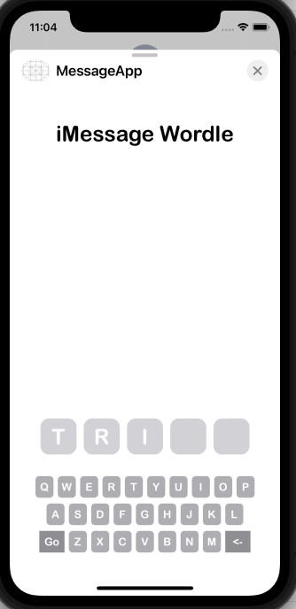  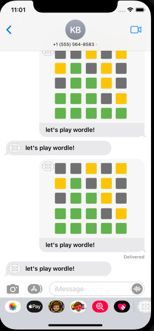

SECOND TERM PROGRESS -

I used my goals at the end of the first term of iOS as a guideline for the first few weeks of the second term. I started by changing the keyboard letters so their colors will display results of previous guesses. I also then had to pass this information over to each player everytime the gameplay is sent over iMessage. After, I worked on implementing a scrollview in order to display a large amount of previous guesses, but after some trial and error I decided to use a textview instead with a scrollable attribute.

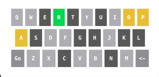

Once I had the functions of the game ready, I worked on ending the game, which happens when either player guesses the target word. This was actually a fairly simple function which included checking to see if the target word matched the actual word, and displaying the win message on the screen. This function also changed the message sent to the other user, which would be titled "Game Over" and display the game over image instead of the normal message image. Along with working on ending the game, I also listened to feedback and added a "Swipe up to play" page which would be displayed when the app was opened. Doing this made it easier for the player to know how to start playing the game, and took away bugs that came up when a player would try to play in compact view.

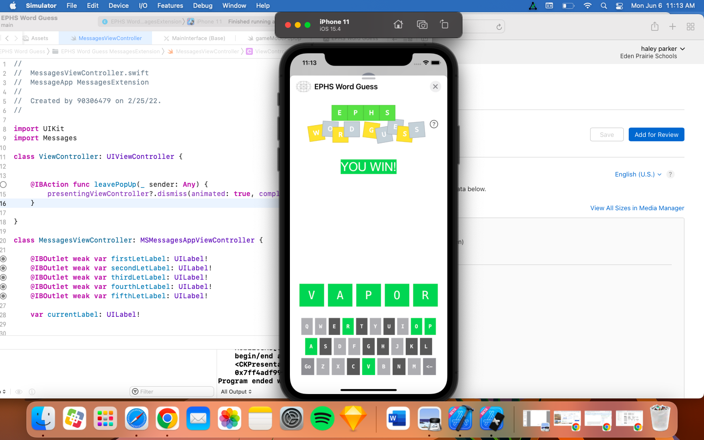 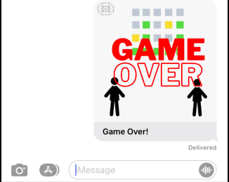

At this point, the app had enough functionality where we felt it was ready to be put into beta testing. We made posters to hang up across the school to encourage people to download the beta version of the app and test it out in order to gain feedback about the app. This feedback brought up the fact that the letter coloring did not always accurately reflect the target words, as it was getting messed up due to double/triple letters in a word. Eventually, I found a way to put each letter of the target word in an array, then remove the letters when used in order to not repeat yellow tiles for double letters. Along with this, I also added delays to create animation for coloring letter to make the process more engaging for the user.

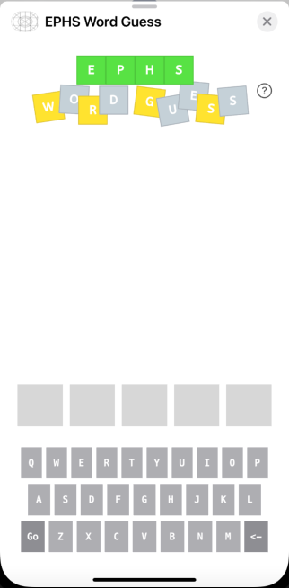

Another piece of feedback that came from beta testing was the act that users were able to play as many times in a row as they wanted, rather than only being allowed one term. After trying without sucess to come up with a solution for this, we met with Paul Ramos to hear his ideas. After this meeting, I followed his suggestions and looked into unique message identifiers. I spent time differentiating remote participant identifiers from local participant identifiers and from sender participant identifiers. I definitely have a better understanding of what these identifiers do now, but I was unfortunately unable to implement them into our code in order to differentiate between each player.

Paul also looked at our code and recommended doing some clean up to it. Taking this advice, I put the extensive lists of 5 letter words into different files to pull from to shorten the length of the main controllerview. I also worked on cleaning up the keyboard letters functions, as their basic functioning was all pretty much the same. 

Throughout the term we also worked on improving the interface and appearance to our app. The title and swipe up elements were designed to be cohesive and follow the theme of our app. We also updated our app icon to match this theme, which involved many different designs as the app icon displayed for iMessage games is much smaller than a regular game's icon. Our design elements were updated many times as we changed the name of the app. We wanted some more unique than "iMessage word Game," but "Friendle" was too close to Wordle so we faced the issue of copyright. We ended up on "EPHS Word Guess".

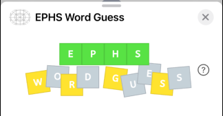 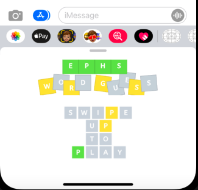

Towards the end of the term, we started looking at getting our app into the app store, the overall goal of the class. We worked on creating unique app screenshots and promotional texts for our app. We submitted the app to the app store 3 times, but each time we were unsuccessful. The first time we had faulty iPad screenshots, the second time we were copyrighted for resemblance to Wordle, and the third time we faced the same error. Although we changed the title from "Friendle," the app functions themselves are too similar to Wordle. We have been working on adding different categories to the app in order to set it apart from Wordle, so hopefully in the next couple of days we can succesfully get it submitted. 

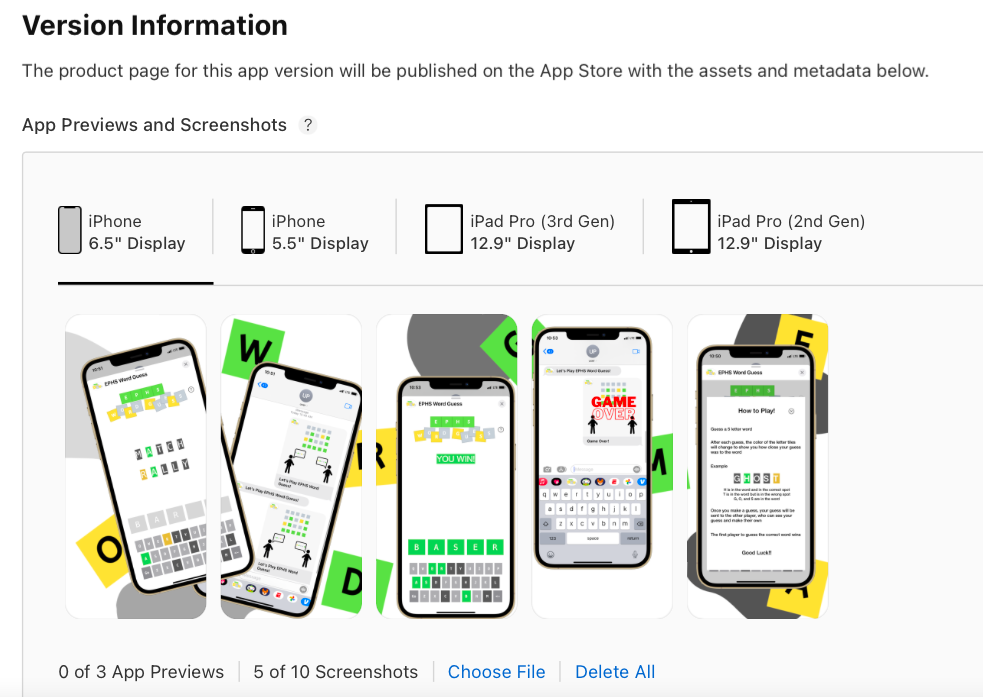

Obviously, if we are unable to do so, our goal for the future would be to get the app into the store. In the future, I would also utilize the extra time to implement remote identifiers into the app so it can track who each player is. We also talked to Paul about adding categories and different word lists into the app, which we believe would be a very interesting aspect to add.

FIRST TERM PROGRESS -

The first thing I worked on when creating our EPHS Word Game was learning the frameworks for coding a program over the iMessage platform. XCode has a built-in guideline for iMessage apps, but it is still relatively new so figuring out its functionality was challenging. Once I learned how the interface for an iMessage game would work, I focused on learning how to send new data from one player to another, which is done my creating then subsequentially decoding a URL with the information that needs to be passed over. 

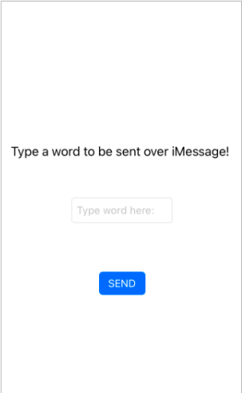  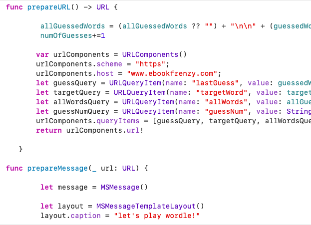

After learning the basic layout for designing an iMessage game, I started creating the user interface for our EPHS Word Game using storyboards. The interface went through a lot of trial and error. Initially, I used textboxes as the placeholders for each letter in the word, and learned how to automatically send the user to the following textbox when one was full. 

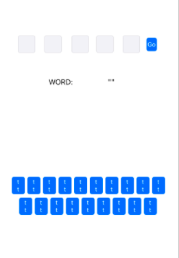

However, I soon realized that in order for the game to display the results of the previous guesses made, the user keyboard must be made of objects, so the letters would more easily be displayed in labels rather than textboxes. I recreated the user interface by creating a keyboard where each letter in a button and set up a row of 5 labels to display the guessed word by the user. 

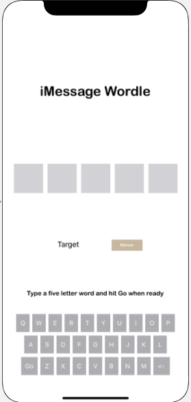

Once the Word Game user interface was ready enough to be used, I turned my focus to coding the actual functionality of the game. Each keyboard button and label had to be tied in from the storyboard to the code and checked to ensure they were functioning correctly. The "GO" button had to be coded to ensure that it would not actually function unless each label held a letter. It also had to check to see if the word guessed by the user is an actual word in the dictionary, which was done by running the word through an array of 5 letter words and seeing if it matched any. 

From there, I started on creating the URL which would be used to send information from one user to another, starting by sending the target word and the word that was last guessed by the user. I had problem decoding the URL and learned that the only type of information that can be a part of the URL is String information.

At this point, I had the user interface and basic code for the Word Game set, so the application would run and pass words over from one player to another. I could then focus on the engaging part of the game, trying to correctly guess the target word. I worked to set the label colors of each letter after the user makes a guess: a correct letter would turn green, a letter in the wrong spot would turn yellow, and an incorrect letter would turn grey. I also worked to set the colors of the keyboard letters to match the ones of the label. The more difficult part was learning a way to send the information about each letter to the next user. Currently, the user recevies the previously guessed words and the color of each letter, but the color of the keyboard keys do not yet udpate. 

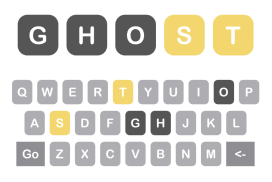  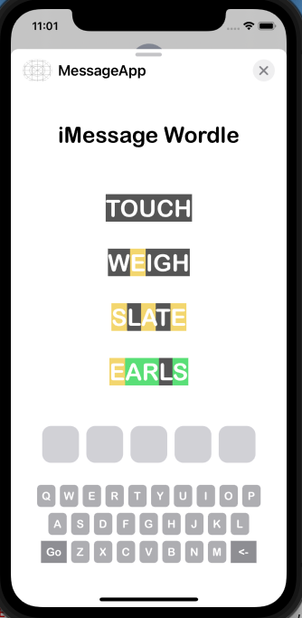

In the coming weeks, I am looking to have the keyboard letter colors update depending on previous guesses. I also still need to learn how to add the previous guesses into a scrollview so they can all be displayed if the players take multiple guesses to identify the word. Finally, I need to figure out how to end the game, which will happen when one of the user's guesses matches the set target word.
